<div align="center">



<br/>

<a href="https://www.linkedin.com/in/YOUR_LINKEDIN_USERNAME">
  
</a>
<a href="mailto:Joshibigyan@gmail.com">
  
</a>
<a href="https://github.com/Bigyancoder">
  
</a>

</div>

<br/>

## About Me

I'm a B.Sc. CSIT student with a strong pull toward **AI and creative technology**. I'm not going to call myself a full-stack developer or an AI engineer here — I'm not there yet, and I'd rather be honest about where I am than dress it up.

What I *am* good at is taking a fuzzy idea, visualizing what it could become, breaking it into pieces, and using AI-assisted development to turn it into something real and testable. I read and reason about the code that gets generated, iterate on it, and push it until it actually works the way I imagined.

```text
const bigyan = {
  identity: "AI & Creative Technology Enthusiast",
  education: "B.Sc. CSIT student",
  approach: "idea → visualize → organize → build with AI → test & iterate",
  honesty: true
};
```

<br/>

## What I'm Exploring

<table>
<tr>
<td width="50%" valign="top">

**Independent programming knowledge**
- Basic HTML
- Basic CSS
- Developing JavaScript knowledge
- Basic Java concepts, with significant AI assistance
- Basic Git / GitHub knowledge, actively developing

</td>
<td width="50%" valign="top">

**Where I actually add value**
- Understanding & visualizing ideas
- Organizing ideas and requirements
- Brainstorming
- Prompt engineering
- AI-assisted development
- Analyzing and testing generated code
- Creative experimentation

</td>
</tr>
</table>

<br/>

## Featured Projects

Every project below was built through **AI-assisted coding** — I'm upfront about that. My role was defining what the project should do, shaping the experience, and testing and iterating on the result.

<table>
<tr>
<td width="50%" valign="top">

### 📓 Digital Notebook
A browser-based notebook that displays pasted text as automatically scrolling notes, with zoom and enlarged-text controls.

**Tech:** `Technology to verify`


[Repository →](https://github.com/YOUR_GITHUB_USERNAME/REPO_NAME)

</td>
<td width="50%" valign="top">

### 🌀 Interactive 3D Visualizer
An experimental browser-based 3D visualization environment with rotation, speed control, and interactive visual elements.

**Tech:** `Technology to verify`


[Repository →](https://github.com/YOUR_GITHUB_USERNAME/REPO_NAME)

</td>
</tr>
<tr>
<td width="50%" valign="top">

### 📖 Split-Screen Text Viewer
A browser experiment that divides long text across multiple screen sections so reading can continue seamlessly across sections.

**Tech:** `Technology to verify`


[Repository →](https://github.com/YOUR_GITHUB_USERNAME/REPO_NAME)

</td>
<td width="50%" valign="top">

### 🧩 Browser Productivity Experiments
Several small Chrome/browser extensions designed to simplify repetitive tasks and improve everyday workflows.

**Tech:** `Technology to verify`

[Repository →](https://github.com/YOUR_GITHUB_USERNAME/REPO_NAME)

</td>
</tr>
</table>

<br/>

## AI × Code Workflow

This is genuinely how I build things — no reason to hide it:

```text
1. Idea         → I picture what the thing should feel like to use
2. Structure    → I break it into requirements and organize the pieces
3. Prompt       → I work with AI tools to generate a working first pass
4. Read & Learn → I read through the generated code to understand it
5. Test         → I run it, break it, find what's missing
6. Iterate      → I refine the prompt / code until it matches the idea
```

<br/>

## Currently Learning


<br/>

## Interests

`AI` · `Web Development` · `Creative Technology` · `AI-Assisted Development` · `Prompt Engineering` · `Browser Tools` · `Interactive Experiences` · `Software Development` · `Digital Technology`

<br/>

## GitHub Activity

<div align="center">


</div>

<sub>Stats above are pulled live from GitHub — nothing here is typed in by hand.</sub>

<br/>

## Connect

<div align="center">

[](https://www.linkedin.com/in/YOUR_LINKEDIN_USERNAME)
[](mailto:Joshibigyan@gmail.com)
[](https://github.com/Bigyancoder)

</div>

<br/>

<div align="center">

<br/>
<sub>Still learning, still building.</sub>
</div>
